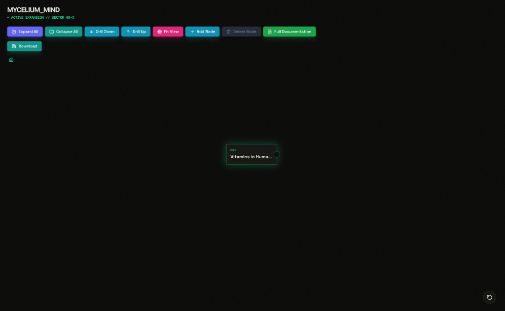
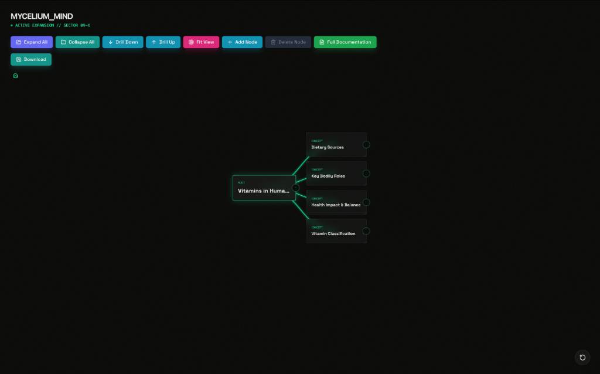

# Mycelium Mind - Vitamins in Human Body Visualization

A **data-driven**, **interactive mind mapping application** built with React and D3.js. Features a sci-fi aesthetic with advanced visualization capabilities including drill-down navigation, collapsible branches, and real-time node editing.


## 📸 Screenshots

### Interactive Demo


### Collapsed View


### Expanded View with Branches


---

## 🚀 Technologies Used

### Core Technologies
- **React 19.2.3** - UI framework for building component-based interfaces
- **TypeScript 5.8.2** - Type-safe JavaScript for better development experience
- **Vite 6.2.0** - Next-generation frontend build tool for fast development

### Key Libraries

#### **D3.js v7.9.0**
- **Purpose**: Data visualization and tree layout algorithms
- **Why**: Industry-standard library for creating complex hierarchical visualizations
- **Usage**: 
  - `d3.hierarchy()` - Converts flat JSON into hierarchical data structure
  - `d3.tree()` - Computes node positions using tree layout algorithm
  - `d3.zoom()` - Pan and zoom behavior for canvas navigation
  - `d3.linkHorizontal()` - Curved link generation between nodes

#### **Lucide React v0.562.0**
- **Purpose**: Icon library
- **Why**: Lightweight, tree-shakeable, and modern icon set
- **Usage**: UI controls (arrows, close, save, folder icons, etc.)

#### **TailwindCSS (CDN)**
- **Purpose**: Utility-first CSS framework
- **Why**: Rapid styling with responsive design utilities
- **Usage**: Layout, colors, spacing, transitions, and responsive design

---

## 📐 Architecture & Approach

### Component Structure

```
App.tsx (Root Component)
├── State Management (useState hooks)
├── GrainOverlay.tsx (Visual texture)
├── Toolbar (Controls & Navigation)
├── MindMapCanvas.tsx (D3 Visualization)
│   ├── SVG Container
│   ├── Zoom/Pan Behavior
│   ├── Links (Edges)
│   └── Nodes (Interactive)
├── SidePanel.tsx (Node Details & Editing)
└── Tooltip.tsx (Hover Information)
```

### Core Components

#### **1. App.tsx** (Main Controller)
- **Responsibility**: Central state management and orchestration
- **State**:
  - `data` - Complete mindmap hierarchy (from `data.json`)
  - `drillPath` - Navigation breadcrumb trail
  - `selectedNode` - Currently selected node for editing
  - `hoverInfo` - Tooltip position and content
- **Key Functions**:
  - `findNode()` - Deep search through hidden/visible children
  - `modifyNode()` - Immutable updates to tree structure
  - `handleNodeClick()` - Selection and panel opening
  - `handleNodeDoubleClick()` - Drill-down navigation
  - `handleToggleCollapse()` - Expand/collapse branches

#### **2. MindMapCanvas.tsx** (Visualization Engine)
- **Responsibility**: Render interactive D3 tree visualization
- **Process**:
  1. Converts React data to D3 hierarchy
  2. Applies tree layout algorithm (node positioning)
  3. Renders SVG with zoom/pan capabilities
  4. Handles user interactions (click, hover, drag)
- **Features**:
  - Dynamic node sizing and spacing
  - Ancestral path highlighting
  - Curved link rendering
  - Fit-to-view calculations

#### **3. SidePanel.tsx** (Node Editor)
- **Responsibility**: Display and edit node properties
- **Editable Fields**:
  - Label
  - Description
  - Status (active/pending/completed)
  - Tags
- **Features**: Slide-in animation, form validation, real-time updates

#### **4. Tooltip.tsx** (Contextual Info)
- **Responsibility**: Show quick info on hover
- **Content**: Node type, label, description preview
- **Positioning**: Dynamic based on mouse coordinates

---

## 📊 Data Flow Architecture

### 1. **JSON Source** (`data.json`)
```json
{
  "id": "root",
  "label": "Central Spore",
  "description": "...",
  "metadata": { ... },
  "children": [ ... ]
}
```

### 2. **Data Loading** (App.tsx)
```typescript
import initialDataRaw from './data.json';
const initialData = initialDataRaw as MindMapNodeData;
const [data, setData] = useState<MindMapNodeData>(initialData);
```

### 3. **State Management**
- **Initial Load**: JSON → React state
- **Updates**: User actions → `modifyNode()` → Immutable state updates
- **HMR Support**: File changes auto-reload via Vite

### 4. **D3 Processing** (MindMapCanvas.tsx)
```typescript
// Convert to D3 hierarchy
const hierarchy = d3.hierarchy(data);

// Apply tree layout
const treeLayout = d3.tree<MindMapNodeData>()
  .nodeSize([80, 240])
  .separation((a, b) => ...);

const rootNode = treeLayout(hierarchy);
```

### 5. **Rendering Pipeline**
```
data.json 
  → React State (App) 
  → useMemo (currentRoot calculation)
  → D3 Hierarchy Processing
  → SVG Rendering (foreignObject for nodes)
  → User Interactions
  → State Updates
  → Re-render
```

---

## 🔄 Data Flow Diagram

```
┌─────────────┐
│ data.json   │ (Source of Truth)
└──────┬──────┘
       │
       ↓
┌─────────────────────────────────┐
│ App.tsx                         │
│ - useState(initialData)         │
│ - drillPath navigation          │
│ - Node CRUD operations          │
└──────┬──────────────────┬───────┘
       │                  │
       ↓                  ↓
┌─────────────┐    ┌─────────────┐
│ MindMap     │    │ SidePanel   │
│ Canvas      │    │ (Editor)    │
│             │    │             │
│ D3 Hierarchy│◄───┤ onUpdate()  │
│ Tree Layout │    │             │
│ SVG Render  │    └─────────────┘
└──────┬──────┘
       │
       ↓
┌─────────────┐
│ User Events │
│ - Click     │
│ - Hover     │
│ - Zoom/Pan  │
└──────┬──────┘
       │
       ↓ (callbacks)
┌─────────────┐
│ App.tsx     │
│ State Update│
└─────────────┘
```

---

## 🎯 Key Features

### 1. **Data-Driven Rendering**
- **Zero Hardcoding**: All visualization generated from `data.json`
- **Hot Module Replacement**: Edit JSON → Instant UI update
- **Type Safety**: TypeScript interfaces ensure data integrity

### 2. **Interactive Navigation**
- **Drill Down**: Double-click or button to focus on subtree
- **Breadcrumbs**: Visual navigation path with clickable history
- **Expand/Collapse**: Toggle visibility of child nodes
- **Fit to View**: Auto-zoom to show entire tree

### 3. **Node Management**
- **Add Node**: Create new children dynamically
- **Delete Node**: Remove nodes (with path protection)
- **Edit In-Place**: Update labels, descriptions, metadata
- **Download State**: Export current tree as JSON

### 4. **Visual Enhancements**
- **Ancestral Highlighting**: Full path from root to selected node
- **Status Colors**: Visual coding by node type (concept/task/note)
- **Smooth Animations**: Transitions for state changes
- **Responsive Design**: Adapts to window resizing

---

## 🛠️ How to Run

```bash
# Install dependencies
npm install

# Start development server
npm run dev

# Build for production
npm run build

# Preview production build
npm run preview
```

Navigate to `http://localhost:3000`

---

## 📝 Customizing Data

### Edit `data.json`

```json
{
  "id": "unique-id",
  "label": "Node Label",
  "description": "Detailed description",
  "metadata": {
    "type": "concept" | "task" | "note" | "root",
    "status": "active" | "pending" | "completed",
    "tags": ["tag1", "tag2"],
    "created": "ISO-8601 timestamp"
  },
  "children": [ /* nested nodes */ ]
}
```

### Type Definitions

See `types.ts` for complete TypeScript interfaces:
- `MindMapNodeData` - Node structure
- `NodeMetadata` - Metadata schema


## 🔧 Technical Decisions

### Why D3.js?
- **Mature Ecosystem**: 10+ years of development
- **Flexibility**: Low-level control over visualization
- **Performance**: Efficient with large datasets
- **Algorithms**: Built-in tree layout calculations

### Why React + D3?
- **Declarative UI**: React manages DOM updates
- **D3 for Math**: Use D3 for calculations, React for rendering
- **Best of Both**: Combine D3's power with React's component model

### Why TypeScript?
- **Type Safety**: Catch errors at compile time
- **IntelliSense**: Better IDE support
- **Maintainability**: Self-documenting code

### Why Vite?
- **Speed**: 10-100x faster than Webpack/CRA
- **Modern**: Native ESM support
- **Simplicity**: Minimal configuration

---

## 📦 Project Structure

```
Mindmap-UI/
├── data.json              # Data source
├── App.tsx                # Main app logic
├── index.tsx              # React entry point
├── index.html             # HTML template
├── types.ts               # TypeScript definitions
├── components/
│   ├── MindMapCanvas.tsx  # D3 visualization
│   ├── SidePanel.tsx      # Edit panel
│   ├── Tooltip.tsx        # Hover tooltips
│   ├── GrainOverlay.tsx   # Visual texture
│   └── Icons.tsx          # Icon exports
├── package.json           # Dependencies
├── tsconfig.json          # TS config
├── vite.config.ts         # Vite config
└── README.md              # This file
```

---

## 🚧 Future Enhancements

- [ ] **Undo/Redo**: History management for edits
- [ ] **Search**: Find nodes by label/tag
- [ ] **Themes**: Multiple color schemes
- [ ] **Export**: PNG/SVG image export
- [ ] **Drag-and-Drop**: Reorder nodes visually
- [ ] **Collaborative Editing**: Real-time multi-user support
- [ ] **Backend Integration**: API for persistent storage

